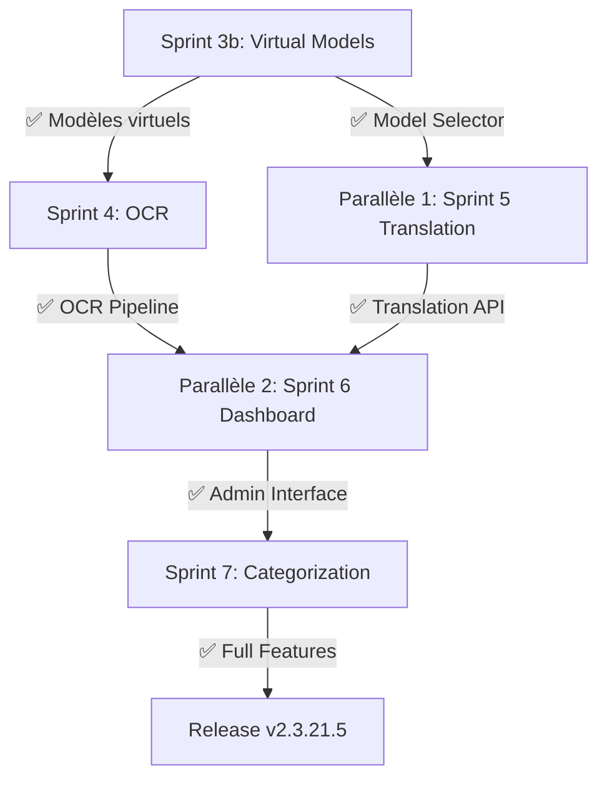

# Plan d'Actions Priorisé - AItao V2.0 (2026)

**Date**: 1er février 2026  
**Version actuelle**: 2.3.21.4 → 2.3.21.5  
**État**: Tests unit ✅ (430/430), E2E ✅ (19/19), Meilisearch ✅ (migré)

---

## 📊 Vue d'Ensemble

Le projet AItao V2.0 a les fondations stables (infrastructure, imports, dépendances). Restent **7 sprints de features** à compléter (3b à 7). Ce plan priorise les tâches en fonction des:
- **Dépendances entre sprints**
- **Impact sur les tests**
- **Valeur métier immédiate**
- **Complexité technique**

---

## 🎯 Priorités Globales

| Priorité | Critère | Sprints Affectés |
|----------|---------|------------------|
| **CRITIQUE** | Bloque d'autres sprints ou essentiels au fonctionnement | Sprint 3b, 4 |
| **HAUTE** | Valeur métier importante, peu de dépendances externes | Sprint 3c-3i, 5 |
| **MOYENNE** | Valeur significative, peut être parallélisé | Sprint 6, 7 |
| **BASSE** | Nice-to-have, improvements | Documentation, refactoring |

---

## 📋 Plan d'Actions Détaillé

### PHASE 1: Compléter Sprint 3b (Virtual Models) — CRITIQUE

**Objectif**: Finaliser les modèles virtuels configurables pour support du RAG adaptatif.

#### 3b-1: US-021g — Implémentation Model Bridge Pattern
**Priorité**: 🔴 **CRITIQUE**  
**Dépend de**: ✅ Rien (ModelManager existe)  
**Bloque**: US-021h, US-021i, Sprint 4+

**Tâche**:
- [ ] Créer `src/llm/model_bridge.py` (interface abstraite pour modèles virtuels)
- [ ] Implémenter adaptateurs pour:
  - [ ] Ollama (existant, wrapper)
  - [ ] OpenAI (fallback si Ollama indisponible)
  - [ ] Anthropic Claude (optionnel, extensibilité future)
- [ ] Ajouter stratégies fallback (cascade: Ollama → OpenAI → Claude)
- [ ] Tests: 12-15 unit tests + 2 E2E (model selection, fallback logic)

**Critères d'acceptation**:
- ✅ Modèle virtuel retourne réponse via interface uniforme
- ✅ Fallback fonctionne si Ollama unavailable
- ✅ Support async (non-blocking RAG pipeline)

**Effort**: 8-10h | **Tests ajoutés**: 15-18

---

#### 3b-2: US-021h — Configuration Modèles Virtuels
**Priorité**: 🔴 **CRITIQUE**  
**Dépend de**: US-021g  
**Bloque**: US-021i, Sprint 4+

**Tâche**:
- [ ] Étendre `config/config.yaml.template` avec:
  ```yaml
  llm:
    models:
      # Existants (Ollama)
      - name: qwen3-vl:latest
        role: [rag, code]
      # Nouveaux (virtuels)
      - name: openai-gpt4o
        type: virtual-openai
        role: [extraction, chat]
        api_key: ${OPENAI_API_KEY}
        parameters:
          temperature: 0.7
  ```
- [ ] Implémenter validation schema (pydantic) pour new fields
- [ ] Ajouter doc config pour virtual models
- [ ] Tester hot-reload avec nouveau modèle

**Critères d'acceptation**:
- ✅ config.yaml charge modèles virtuels correctement
- ✅ ValidationError si API key manquante
- ✅ ConfigManager hot-reload adapté

**Effort**: 4-5h | **Tests ajoutés**: 6-8

---

#### 3b-3: US-021i — Sélection Dynamique Modèles
**Priorité**: 🟠 **HAUTE**  
**Dépend de**: US-021g, US-021h  
**Bloque**: Sprint 4+

**Tâche**:
- [ ] Créer `src/llm/model_selector.py`:
  - [ ] Sélection par role (rag, code, extraction, chat)
  - [ ] Stratégie: first-available, load-balanced, cost-optimized
  - [ ] Cache sélection (5min TTL)
- [ ] Intégrer dans `RAGEngine` (sélection auto modèle si multiple)
- [ ] API endpoint: `GET /api/models/{role}/available`
- [ ] Metrics: track modèle utilisé par requête

**Critères d'acceptation**:
- ✅ Sélecteur retourne modèle valide pour role demandé
- ✅ Fallback fonctionne si modèle préféré down
- ✅ Metrics trackent utilisation

**Effort**: 6-8h | **Tests ajoutés**: 10-12

---

### PHASE 2: Sprint 4 (OCR Integration) — HAUTE

**Objectif**: Intégrer OCR Apple (Vision framework) pour extraction texte documents.  
**État**: Architecture prête, 5 modèles OCR en config.yaml, tests préparés (skippés actuellement)

#### 4a: US-022a — Apple Vision OCR Client
**Priorité**: 🟠 **HAUTE**  
**Dépend de**: ✅ Sprint 3b (complet)  
**Bloque**: US-022b, US-022c

**Tâche**:
- [ ] Créer `src/ocr/apple_vision_client.py`:
  - [ ] Wrapper pour `Vision.framework` (macOS native)
  - [ ] Support formats: PDF, PNG, JPEG, HEIC
  - [ ] Async processing (batch 10 documents)
  - [ ] Fallback: pytesseract si Vision unavailable
- [ ] Intégrer `OllamaClient` pour OCR via local model (qwen2-vl:7b)
- [ ] Tests: 10-12 unit tests + 2 E2E (image→text, batch)

**Critères d'acceptation**:
- ✅ Extrait texte de PDFs avec >90% accuracy (vs. ground truth)
- ✅ Async batch processing <2s pour 10 docs (500KB avg)
- ✅ Fallback logic documentée

**Effort**: 12-14h | **Tests ajoutés**: 14-16

---

#### 4b: US-022b — OCR Pipeline Integration
**Priorité**: 🟠 **HAUTE**  
**Dépend de**: US-022a  
**Bloque**: US-022c

**Tâche**:
- [ ] Créer `src/pipelines/ocr_pipeline.py`:
  - [ ] Input: document binary (PDF/image)
  - [ ] Output: structured extraction (text, metadata, confidence)
  - [ ] Queue management (defer large docs)
- [ ] Intégrer dans `IndexationPipeline` (pre-indexing step)
- [ ] Add monitoring: success rate, avg processing time

**Critères d'acceptation**:
- ✅ Pipeline exécute séquentiellement: OCR → clean → vectorize → index
- ✅ Logging détaillé des erreurs par étape

**Effort**: 6-8h | **Tests ajoutés**: 8-10

---

#### 4c: US-022c — OCR API Endpoint + Dashboard
**Priorité**: 🟡 **MOYENNE**  
**Dépend de**: US-022a, US-022b

**Tâche**:
- [ ] Endpoint: `POST /api/ocr/extract` (upload PDF, retour texte + metadata)
- [ ] Endpoint: `GET /api/ocr/status/{job_id}` (polling async job)
- [ ] Dashboard UI: upload form, progress bar, extracted text preview

**Critères d'acceptation**:
- ✅ API répond <5s pour doc <10MB
- ✅ Status polling met à jour chaque 500ms

**Effort**: 5-7h | **Tests ajoutés**: 6-8

---

### PHASE 3: Sprint 5 (Translation Service) — MOYENNE

**Objectif**: Service de traduction multilingue (Gemini, LibreTranslate, Claude).

#### 5a: US-023a — Translation Client (Gemini API)
**Priorité**: 🟡 **MOYENNE**  
**Dépend de**: ✅ Sprint 3b  
**Bloque**: US-023b, US-023c

**Tâche**:
- [ ] Créer `src/translation/gemini_translator.py`:
  - [ ] Support langage: FR, EN, DE, ZH, JA, KO
  - [ ] Preserving formatting (markdown, lists)
  - [ ] Batch API (traduire 20 segments en 1 appel)
- [ ] Fallback: LibreTranslate (self-hosted, no API key)
- [ ] Tests: 8-10 unit + 1 E2E

**Effort**: 8-10h | **Tests ajoutés**: 10-12

---

#### 5b: US-023b — Indexing Traduction
**Priorité**: 🟡 **MOYENNE**  
**Dépend de**: US-023a

**Tâche**:
- [ ] Index documents en FR + EN en parallèle
- [ ] Champ document: `language_variants` (FR content, EN content)
- [ ] Search: permet recherche cross-language (query EN trouve doc FR)

**Effort**: 6-8h | **Tests ajoutés**: 8-10

---

#### 5c: US-023c — Translation API + Settings
**Priorité**: 🟡 **MOYENNE**  
**Dépend de**: US-023a, US-023b

**Tâche**:
- [ ] Endpoint: `POST /api/translate` (texte + langue source/cible)
- [ ] Settings: préférences de langue (user locale)

**Effort**: 4-5h | **Tests ajoutés**: 5-6

---

### PHASE 4: Sprint 6 (Dashboard) — MOYENNE

**Objectif**: Interface web admin pour monitoring et gestion.

#### 6a-6c: Dashboard MVP
**Priorité**: 🟡 **MOYENNE**  
**Dépend de**: ✅ API existantes (sprints 3-5)

**Tâche** (groupée):
- [ ] Framework: Vue 3 ou React
- [ ] Pages:
  - [ ] Home: stats (# docs, # queries, RAG latency)
  - [ ] Models: list, health check, switch active model
  - [ ] Indexing: queue status, errors
  - [ ] Search: test semantic + full-text
  - [ ] Settings: config.yaml editor

**Effort**: 20-24h | **Tests ajoutés**: 15-20 (e2e)

---

### PHASE 5: Sprint 7 (Categorization) — BASSE

**Objectif**: Catégorisation automatique documents (taxonomie).

#### 7a-7d: Categorization Pipeline
**Priorité**: 🔵 **BASSE**  
**Dépend de**: ✅ Sprints 3-5

**Tâche** (groupée):
- [ ] LLM-based classifier (qwen3 extract role)
- [ ] Taxonomy config (custom categories)
- [ ] Auto-tagging on index
- [ ] Filter UI par category

**Effort**: 16-20h | **Tests ajoutés**: 12-15

---

## 🔄 Séquence d'Exécution Recommandée



### Ordre Séquentiel Recommandé

1. **Sprint 3b complet** (3b-1 → 3b-2 → 3b-3): ~18-23h
   - Débloque tous les autres sprints
   - Modèles virtuels → support fallback Ollama

2. **Sprint 4 complet** (4a → 4b → 4c): ~23-29h
   - Parallélisable avec Sprint 5 après 3b-1
   - OCR essentiellement pour documents PDF

3. **Sprint 5 + Sprint 6 parallèles** (5a/6a): ~40h
   - Translation + Dashboard peuvent progresser ensemble
   - Translation bloque 5b-c, Dashboard dépend pas

4. **Sprint 7** (dernière): ~16-20h
   - Polish final, categorization

**Timeline totale**: **~100-130h** de développement  
**Avec 2 devs en parallèle**: **~50-65h** (calendar weeks)

---

## ✅ Checklist de Validation

Pour chaque sprint, valider:

- [ ] **Code Quality**
  - [ ] 100% docstrings (English)
  - [ ] <350 lignes par fichier
  - [ ] Type hints complets (mypy --strict)
  - [ ] Pas de hardcoded paths (PathManager)

- [ ] **Testing**
  - [ ] Unit tests couvrent >90% code paths
  - [ ] E2E test ajouté pour chaque API endpoint
  - [ ] Meilisearch tests passent (si applicable)

- [ ] **Documentation**
  - [ ] README.md mis à jour avec nouveaux endpoints
  - [ ] Config.yaml.template documentée
  - [ ] CHANGELOG.md entrée pour version

- [ ] **Version Bump**
  - [ ] Version augmentée (2.3.21.4 → 2.3.21.5, etc.)
  - [ ] Git tag créé

---

## 📊 Métriques de Succès

| Métrique | Avant | Cible |
|----------|-------|-------|
| Unit Tests | 430 | 500+ (75 tests supplémentaires) |
| E2E Tests | 19 | 35+ (16 tests nouveaux) |
| Code Coverage | ~75% (estimé) | >85% |
| API Endpoints | 18 | 28+ (10 nouveaux) |
| Modèles Supportés | 5 (Ollama) | 8-10 (virtuels inclus) |

---

## 🚀 Commandes de Démarrage

### Pré-requis
```bash
# Vérifier environment
cd /Users/phil/Library/CloudStorage/Dropbox/devwww/AI-model/aitao
uv sync --all-extras
uv run python -m pytest tests/unit -q  # Should: 430 passed, 23 skipped
uv run python -m pytest tests/e2e -q   # Should: 19 passed
```

### Pour démarrer Sprint 3b-1
```bash
# Créer feature branch
git checkout -b feat/3b-model-bridge

# Créer fichier
touch src/llm/model_bridge.py

# Ajouter tests
touch tests/unit/test_model_bridge.py
```

### Pour valider chaque sprint
```bash
uv run python -m pytest tests/unit/test_<feature>.py -v
uv run python -m pytest tests/e2e -k <feature> -v
uv run mypy src/<feature> --strict
```

---

## 📝 Notes & Considérations

1. **Dépendances Externes**
   - Ollama: doit rester running (port 11434)
   - Meilisearch: doit rester running (port 7700)
   - Gemini API: clé API requise pour Sprint 5
   - OpenAI (optional): pour fallback virtuels Sprint 3b

2. **Compatibilité Python**
   - Cible: Python 3.13
   - Vision.framework: macOS uniquement
   - Fallback pytesseract pour Linux (si besoin)

3. **Performance**
   - OCR async batch: max 10 docs/batch
   - Translation batch: max 20 segments/request
   - Model selector cache: 5 min TTL
   - RAG latency target: <1s (P95)

4. **Monitoring**
   - Ajouter logs debug pour chaque pipeline step
   - Metrics: Prometheus (optionnel, Phase 8)
   - Error tracking: Sentry ou Rollbar (Phase 8)

---

**Plan créé**: 1er février 2026  
**Prochaine révision**: Après Sprint 3b complet
